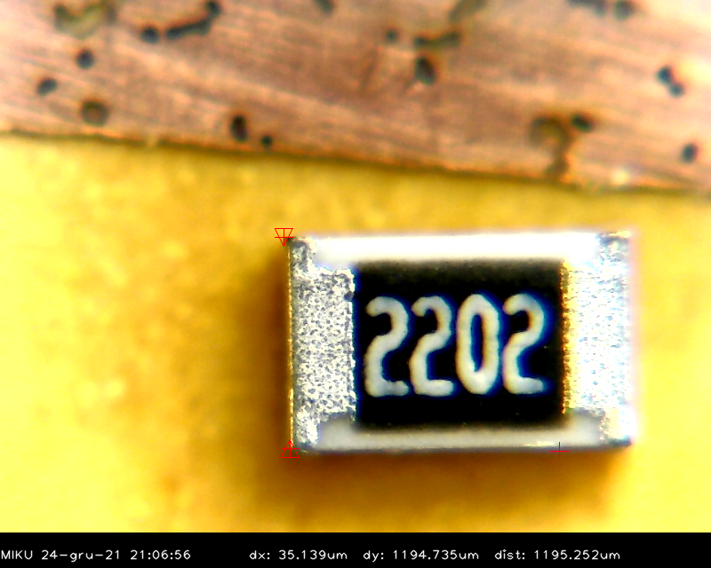

# MIKU (Mikroscope Utility)

Program for measurements of microscopic images.

This is in development and is very crude, but works.

Basic usage:

Click the LMB to mark point A, then click again to mark point B. Third click deletes the points

* `s` - save screenshot
* `c` - enter calibration mode (measure a known distance, and enter it). Enter zero to cancel. 
* `q` - exit program

# Install dependencies and compile

    sudo apt instal libopencv-dev
	make
	
Run:

	./miku
